## a. Lihat Landing Page

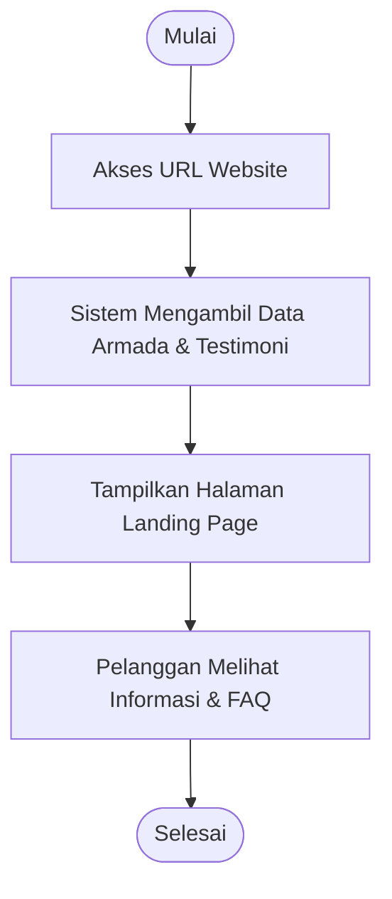

---

## b. Reservasi Armada

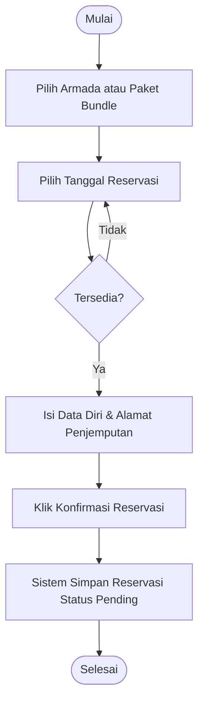

---

## c. Pembayaran

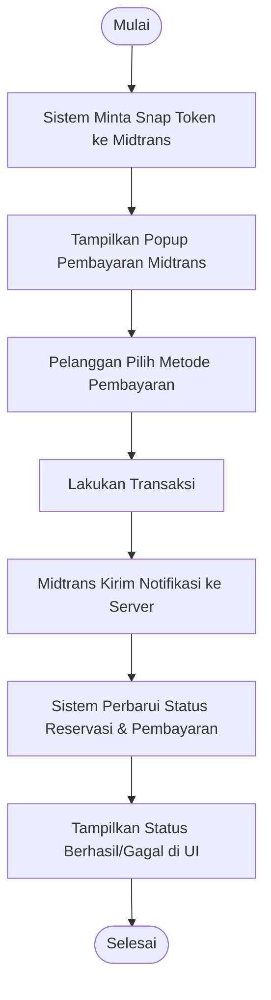

---

## d. Lihat Bukti Reservasi

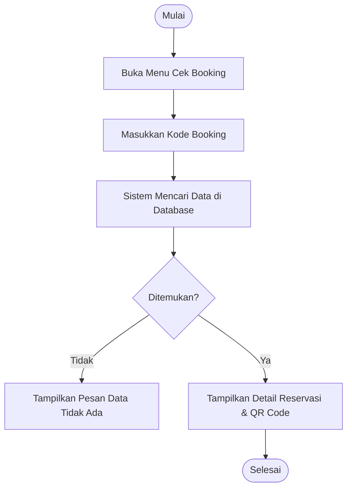

---

## e. Login Admin

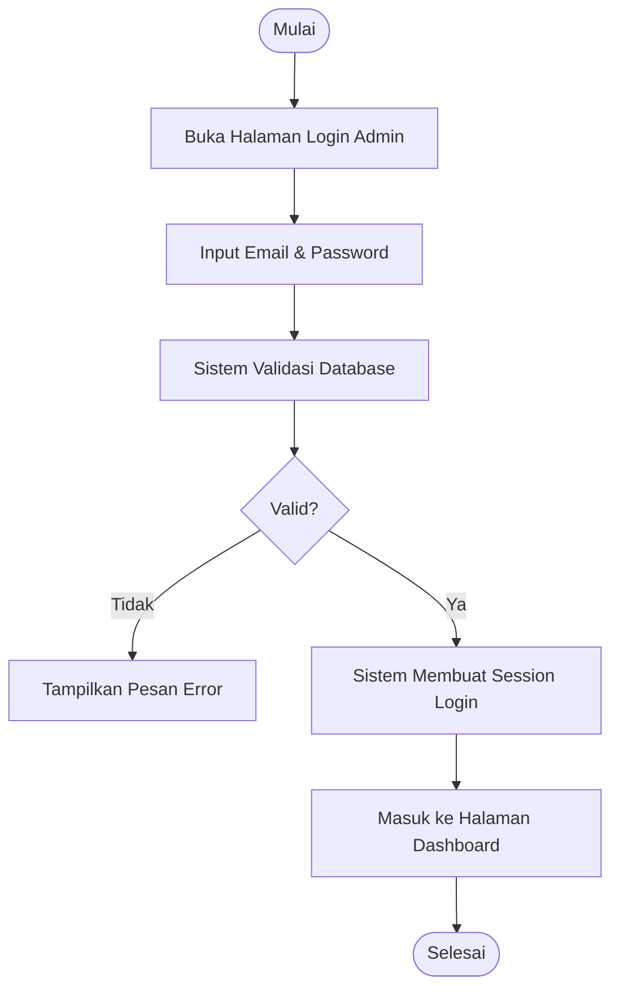

---

## f. Kelola Armada

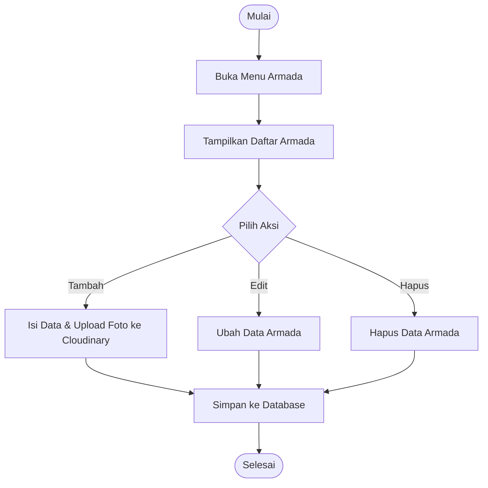

---

## g. Kelola Gallery

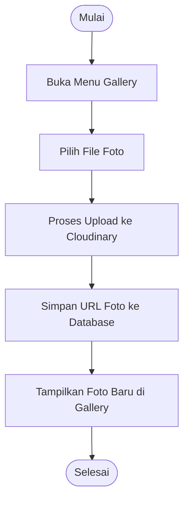

---

## h. Kelola Akomodasi (Package Bundle)

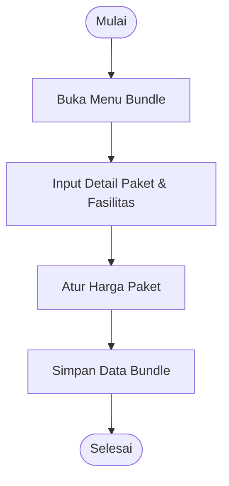

---

## i. Kelola Reservasi

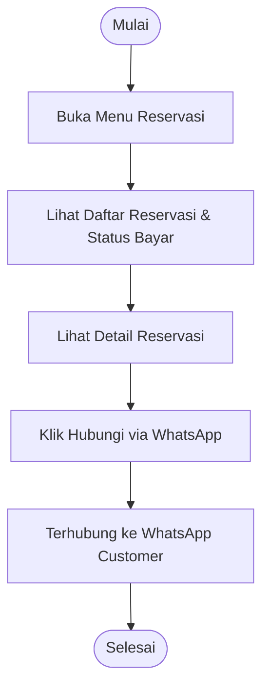

---

## j. Kelola Laporan

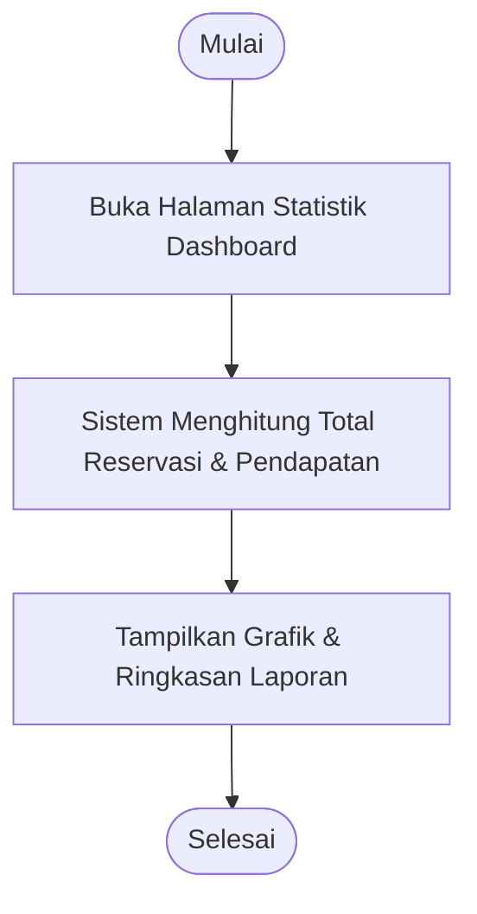

---

## k. Logout

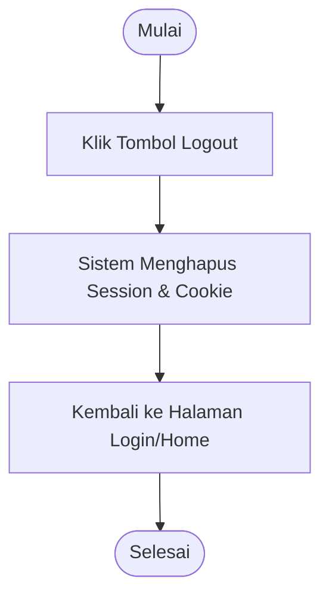
