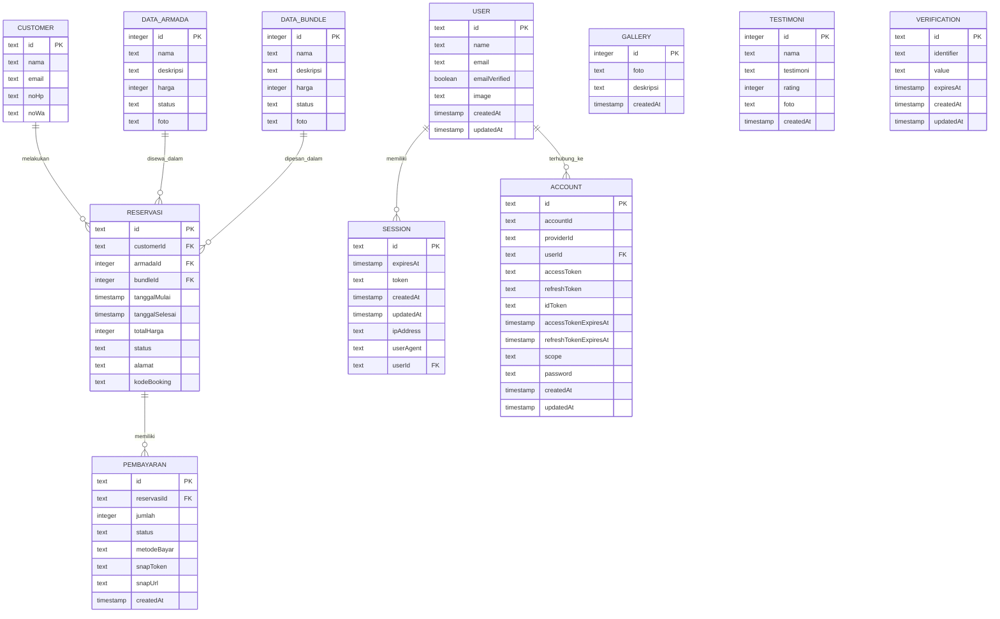

```mermaid
erDiagram
    CUSTOMER ||--o{ RESERVASI : "melakukan"
    DATA_ARMADA ||--o{ RESERVASI : "disewa_dalam"
    DATA_BUNDLE ||--o{ RESERVASI : "dipesan_dalam"
    RESERVASI ||--o{ PEMBAYARAN : "memiliki"
    
    USER ||--o{ SESSION : "memiliki"
    USER ||--o{ ACCOUNT : "terhubung_ke"

    CUSTOMER {
        text id PK
        text nama
        text email
        text noHp
        text noWa
    }

    DATA_ARMADA {
        integer id PK
        text nama
        text deskripsi
        integer harga
        text status
        text foto
    }

    DATA_BUNDLE {
        integer id PK
        text nama
        text deskripsi
        integer harga
        text status
        text foto
    }

    RESERVASI {
        text id PK
        text customerId FK
        integer armadaId FK
        integer bundleId FK
        timestamp tanggalMulai
        timestamp tanggalSelesai
        integer totalHarga
        text status
        text alamat
        text kodeBooking
    }

    PEMBAYARAN {
        text id PK
        text reservasiId FK
        integer jumlah
        text status
        text metodeBayar
        text snapToken
        text snapUrl
        timestamp createdAt
    }

    GALLERY {
        integer id PK
        text foto
        text deskripsi
        timestamp createdAt
    }

    TESTIMONI {
        integer id PK
        text nama
        text testimoni
        integer rating
        text foto
        timestamp createdAt
    }

    USER {
        text id PK
        text name
        text email
        boolean emailVerified
        text image
        timestamp createdAt
        timestamp updatedAt
    }

    SESSION {
        text id PK
        timestamp expiresAt
        text token
        timestamp createdAt
        timestamp updatedAt
        text ipAddress
        text userAgent
        text userId FK
    }

    ACCOUNT {
        text id PK
        text accountId
        text providerId
        text userId FK
        text accessToken
        text refreshToken
        text idToken
        timestamp accessTokenExpiresAt
        timestamp refreshTokenExpiresAt
        text scope
        text password
        timestamp createdAt
        timestamp updatedAt
    }

    VERIFICATION {
        text id PK
        text identifier
        text value
        timestamp expiresAt
        timestamp createdAt
        timestamp updatedAt
    }
```