Rangkaian Sequence Diagram Jeep Station PuncakDokumen ini berisi detail sequence diagram untuk setiap proses utama dalam sistem, menggambarkan interaksi antar objek dan aktor.

---
a. Sequence Diagram: Lihat Landing Page
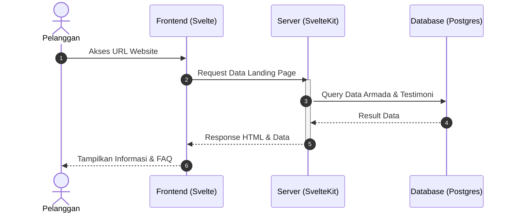
b. Sequence Diagram: Reservasi Armada
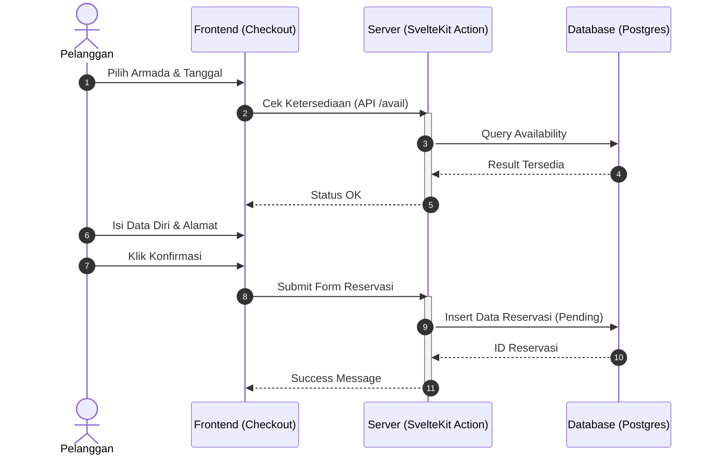
c. Sequence Diagram: Pembayaran
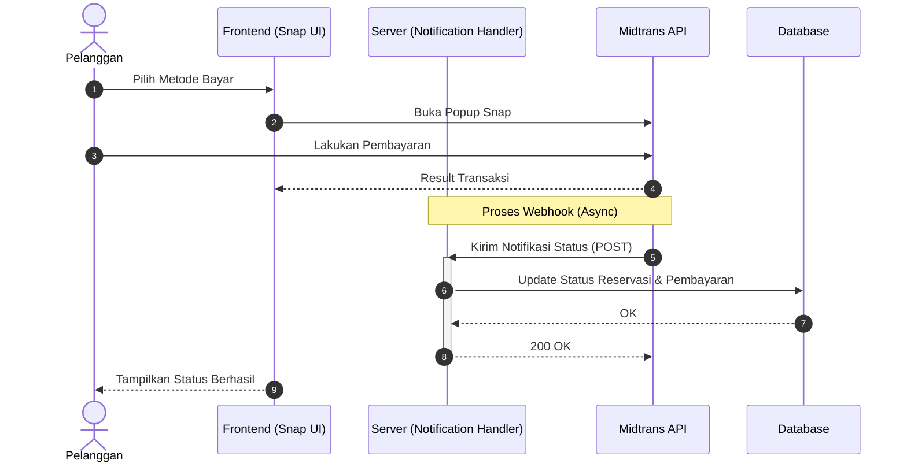
d. Sequence Diagram: Lihat Bukti Reservasi
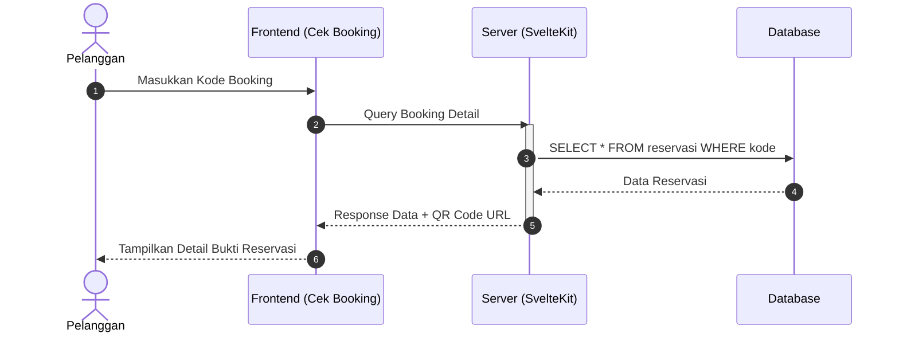
e. Sequence Diagram: Login
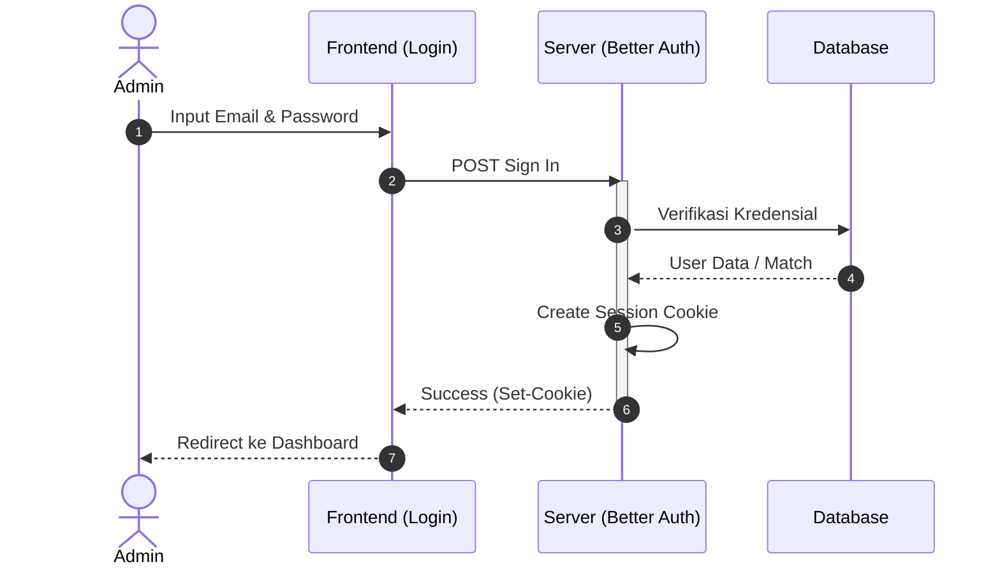
f. Sequence Diagram: Kelola Armada
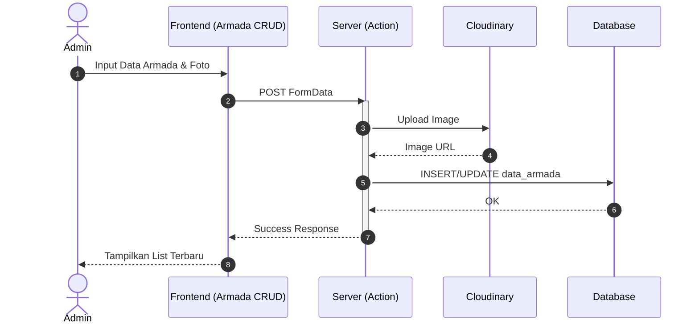
g. Sequence Diagram: Kelola Gallery
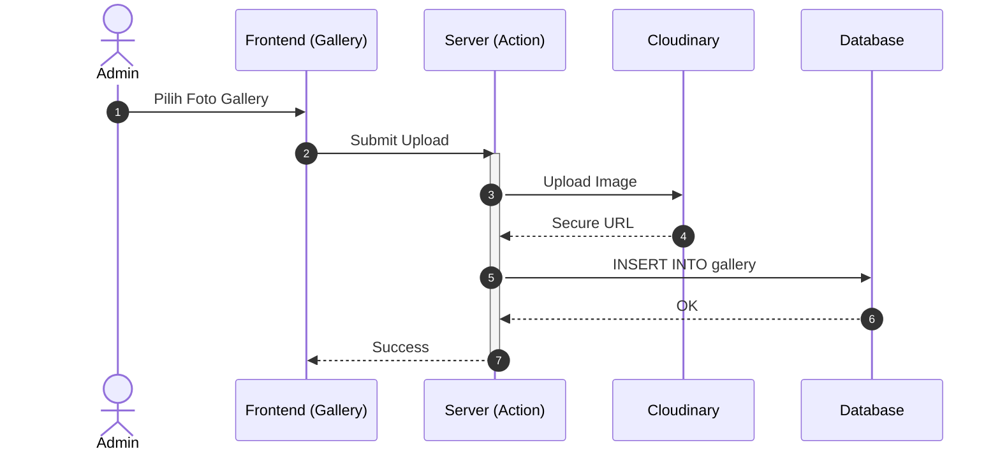
h. Sequence Diagram: Kelola Akomodasi (Package Bundle)
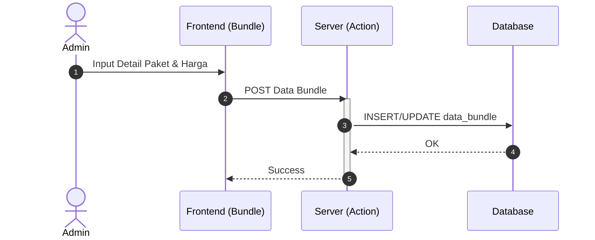
i. Sequence Diagram: Kelola Reservasi
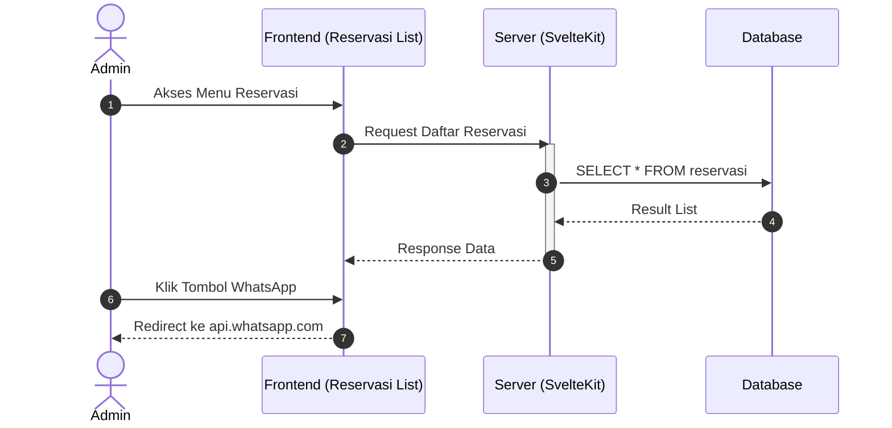
j. Sequence Diagram: Kelola Laporan
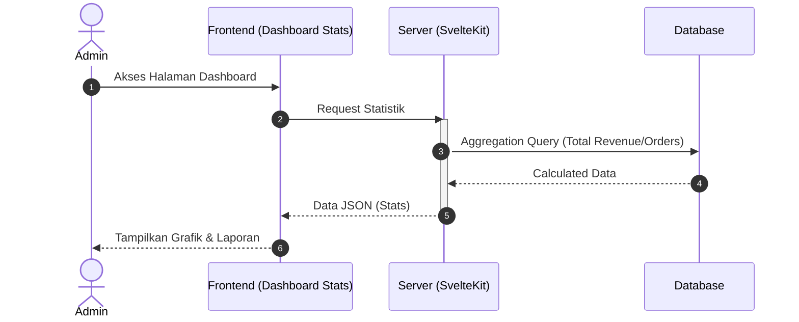
k. Sequence Diagram: Kelola Logout
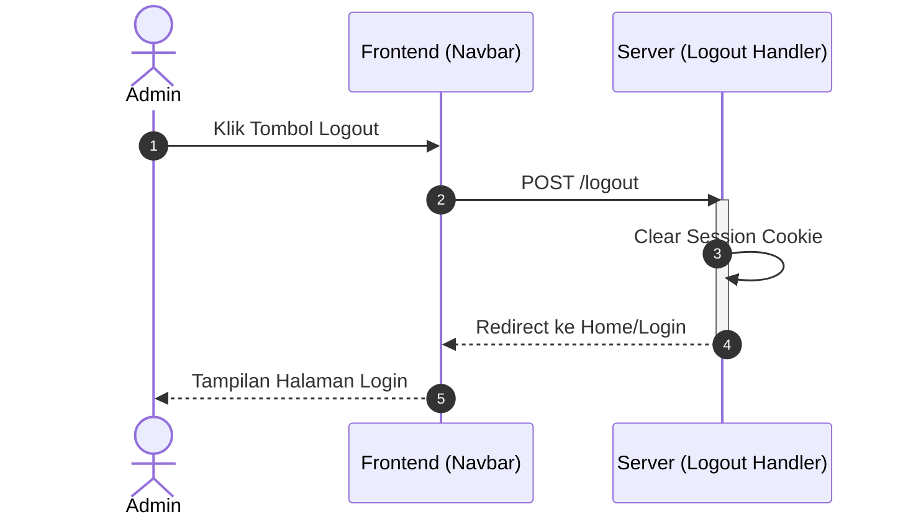