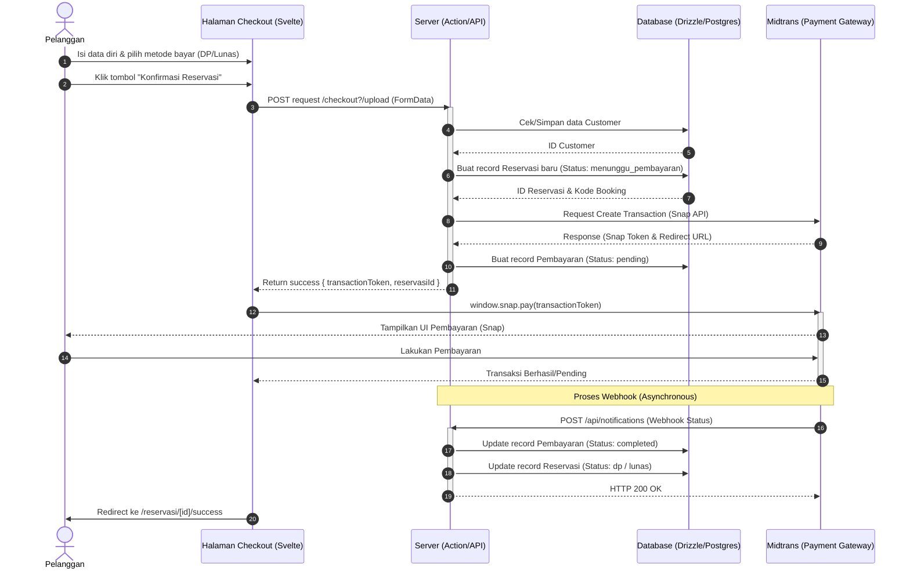

```mermaid
sequenceDiagram
    autonumber
    actor Pelanggan
    participant FE as Halaman Checkout (Svelte)
    participant BE as Server (Action/API)
    participant DB as Database (Drizzle/Postgres)
    participant MT as Midtrans (Payment Gateway)

    Pelanggan->>FE: Isi data diri & pilih metode bayar (DP/Lunas)
    Pelanggan->>FE: Klik tombol "Konfirmasi Reservasi"
    
    FE->>BE: POST request /checkout?/upload (FormData)
    activate BE
    
    BE->>DB: Cek/Simpan data Customer
    DB-->>BE: ID Customer
    
    BE->>DB: Buat record Reservasi baru (Status: menunggu_pembayaran)
    DB-->>BE: ID Reservasi & Kode Booking
    
    BE->>MT: Request Create Transaction (Snap API)
    MT-->>BE: Response (Snap Token & Redirect URL)
    
    BE->>DB: Buat record Pembayaran (Status: pending)
    
    BE-->>FE: Return success { transactionToken, reservasiId }
    deactivate BE

    FE->>MT: window.snap.pay(transactionToken)
    activate MT
    MT-->>Pelanggan: Tampilkan UI Pembayaran (Snap)
    Pelanggan->>MT: Lakukan Pembayaran
    MT-->>FE: Transaksi Berhasil/Pending
    deactivate MT

    Note over MT, BE: Proses Webhook (Asynchronous)
    
    MT->>BE: POST /api/notifications (Webhook Status)
    activate BE
    BE->>DB: Update record Pembayaran (Status: completed)
    BE->>DB: Update record Reservasi (Status: dp / lunas)
    BE-->>MT: HTTP 200 OK
    deactivate BE

    FE->>Pelanggan: Redirect ke /reservasi/[id]/success
```